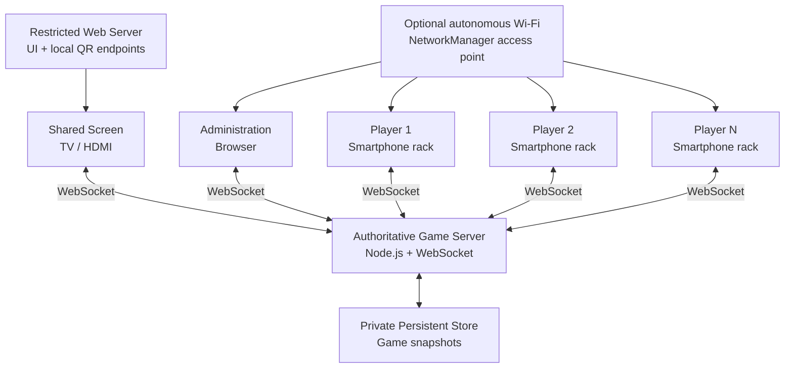
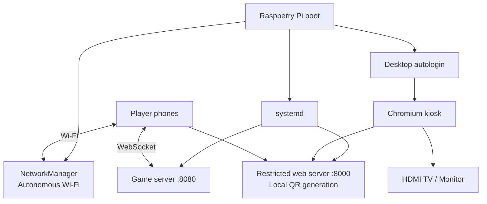

# Electronic Scrabble

Electronic Scrabble is a local multiplayer Scrabble-style application where a shared television or monitor displays the public board while each player's smartphone acts as a private electronic tile rack.

The project is designed to run on a local network and ultimately as a self-contained Raspberry Pi console with no Internet connection required during play.

> **Trademark note:** Scrabble is a registered trademark owned by its respective rights holders. This project is independent and is not affiliated with or endorsed by those rights holders.

## Current Features

- 2 to 4 local players
- 15 × 15 board with standard premium-square layout
- French 102-tile distribution with two blanks
- private seven-tile smartphone racks
- complete fit-to-width mobile board without gameplay zoom
- local rack rearrangement and shuffle
- direct drag-and-drop from the private rack to the board
- move placement, provisional tile repositioning, and structural validation
- score calculation, cross words, premium squares, and 50-point seven-tile bonus
- pass and tile exchange actions
- first-player draw
- final scoring and end-game detection
- pluggable word validation
- optional challenge workflow
- persistent game snapshots, automatic reconnection, stopped-game resume, history, and purge
- elapsed-time or countdown turn clock
- shared themes
- English and French interfaces
- dedicated Raspberry Pi console mode
- autonomous Raspberry Pi Wi-Fi access point with fixed local address
- offline Wi-Fi and game-join QR codes on the shared screen
- administrator-controlled game stop, safe reboot, power-off, and Raspberry Pi Wi-Fi configuration

## Architecture




The game server is authoritative. Browser clients submit intentions; they do not directly modify scores, the bag, racks, or board state.

## Privacy Model

Public clients receive only public state.

The shared screen never receives player rack contents or player recovery tokens. Each smartphone receives only its own private rack state.

Persistent snapshots are private server data and include information that must never be served over HTTP.

## Interfaces

### Administration

```text
/admin/
```

The administration interface creates and resumes games, configures the turn clock and per-game word-validation provider/policy, determines the first player, starts or pauses play, reopens stopped games, manages persistent history/purge, displays game status, and controls a dedicated Raspberry Pi console when console mode is enabled. A paused game may change its word-validation provider or policy before it is resumed. On an installed Raspberry Pi console, the same interface can configure the autonomous Wi-Fi SSID, password, regulatory country, and optional immediate activation. The desktop layout uses a compact dashboard so active-game information fits much better on ordinary PC displays.

### Player

```text
/player/?game=ABCD
```

The smartphone interface provides the private rack, reliable touch-based tile rearrangement, direct drag-and-drop from rack to empty board squares, a complete fit-to-width board without gameplay zoom, provisional tile repositioning directly on the board, move preparation, exchange, pass, challenge, and final result views. Blank tiles still require a letter choice before their direct drag is committed.

### Shared Screen

Game-specific mode:

```text
/screen/?game=ABCD
```

Dedicated Raspberry Pi console mode:

```text
/screen/?console=1
```

Console mode automatically follows the current local game and survives server restarts without embedding a changing game code in the kiosk URL. A game-specific player QR code is available on ordinary LAN/VM environments as well as on Raspberry Pi. A Wi-Fi configuration QR code is displayed whenever an SSID and password are configured. On Raspberry Pi standalone mode those values are written automatically by the access-point configurator; on a VM they can be supplied explicitly for LAN Wi-Fi testing.

## Internationalization

English is the canonical interface language. Translations are stored as resource bundles:

```text
shared/i18n/
├── en.js
└── fr.js
```

Internal game values are language-neutral. For example, a double-word square remains `DW` internally while the French interface displays `MD` (*Mot Double*).

English and French bundles are tested to expose identical keys.

## Themes

Themes are implemented through CSS custom properties and are independent from game logic and language resources.

```text
shared/css/themes/
├── classic.css
├── midnight.css
└── forest.css
```

A future custom theme only needs to override semantic design tokens.

## Word Validation

The game engine supports pluggable word-validation providers. No unauthorized ODS word list is included in this repository.

### Local authorized dictionary

If an authorized lexical resource is available, it can be configured privately:

```bash
export ELECTRONIC_SCRABBLE_DICTIONARY_MODE=required
export ELECTRONIC_SCRABBLE_DICTIONARY_PATH=/private/path/authorized-words.txt
export ELECTRONIC_SCRABBLE_DICTIONARY_NAME="Authorized French dictionary"
```

### FFSc online ODS 9 checker

When Internet access is available, the server can query the Fédération Française de Scrabble online checker without downloading or redistributing an ODS word list:

```bash
export ELECTRONIC_SCRABBLE_DICTIONARY_MODE=ffsc
export ELECTRONIC_SCRABBLE_DICTIONARY_NAME="FFSc ODS 9 online"
export ELECTRONIC_SCRABBLE_WORD_VALIDATION_POLICY=challenge
```

The request is sent server-side to the FFSc WordPress AJAX checker with the checker page as the HTTP `Referer`. Responses are parsed from the `right-answer` / `wrong-answer` result classes. Remote timeouts, HTTP errors, or unexpected markup produce `WORD_CHECK_UNAVAILABLE`; they are never treated as an invalid word. In challenge mode, an unsuccessful challenge applies the current 5-point penalty indicated by the checker response.

The FFSc checker endpoint is an implementation detail of the federation website, not a documented public API contract. The integration is therefore isolated behind a provider module, uses a bounded in-memory cache, and may need maintenance if the site changes.

The administrator chooses the provider and policy per game. These settings are editable in the lobby, locked during active starting/playing phases, and editable again while the game is paused. This allows a mistaken provider or policy to be corrected without abandoning the persisted game.

See [`docs/word-validation.md`](docs/word-validation.md).

## Persistence

Games are persisted as private JSON snapshots.

Development default:

```text
~/.local/share/electronic-scrabble/games/
```

Raspberry Pi console default:

```text
/var/lib/electronic-scrabble/games/
```

After a server restart, players, administration, and the shared screen automatically reconnect and resume the persisted game. Games paused with **Stop Game** remain resumable and return to their previous lobby/starting/playing phase when the administrator selects **Resume Game**.

See [`docs/persistence-and-turn-clock.md`](docs/persistence-and-turn-clock.md).

### Game history, resume, and purge

The administration dashboard lists games whose private administrator token is still stored by that browser. A stopped game can be reopened and resumed in its previous phase. Finished or stopped games can be permanently purged from both server memory and the private snapshot directory. Active games must be stopped before purge. See [`docs/game-management.md`](docs/game-management.md).

## Turn Clock

The administration interface can select:

- elapsed time;
- 60-second countdown;
- 90-second countdown;
- 120-second countdown;
- 180-second countdown;
- disabled.

The clock is displayed on the shared screen. Countdown expiration is currently informational and does not automatically end the player's turn.

## Raspberry Pi Console

The project includes a deployment mode for Raspberry Pi OS with Desktop.




Basic console installation:

```bash
sudo bash deploy/raspberry-pi/install.sh
sudo reboot
```

The installer sets up:

- `electronic-scrabble-server.service`;
- `electronic-scrabble-web.service`;
- private persistent storage;
- platform-independent Node.js QR generation through the `qrcode` dependency;
- Chromium kiosk launch through the Raspberry Pi OS Labwc desktop autostart;
- desktop autologin;
- the autonomous Wi-Fi configurator;
- administrator Wi-Fi configuration through the authenticated console controls;
- narrowly scoped administrator reboot, power-off, and Wi-Fi-helper permissions.

### Completely standalone Wi-Fi

To configure the Raspberry Pi as its own access point during installation:

```bash
sudo ELECTRONIC_SCRABBLE_CONFIGURE_ACCESS_POINT=1 \
     ELECTRONIC_SCRABBLE_WIFI_SSID="ElectronicScrabble" \
     ELECTRONIC_SCRABBLE_WIFI_PASSWORD="MyGame1234" \
     bash deploy/raspberry-pi/install.sh
sudo reboot
```

The default console network address is:

```text
10.42.0.1
```

Players can then connect without a router or Internet connection. In autonomous access-point mode the HDMI screen displays two local QR codes during the lobby:

1. Wi-Fi configuration QR code;
2. game-specific player URL QR code.

Outside access-point mode, including development in a Linux VM, the player QR code is still generated using the detected LAN address. Set `ELECTRONIC_SCRABBLE_PUBLIC_BASE_URL` when the automatically detected VM address is not reachable from the phones.

A Wi-Fi QR can also be tested on a VM by explicitly describing the existing Wi-Fi network before starting the web service:

```bash
export ELECTRONIC_SCRABBLE_WIFI_SSID="MyWifi"
export ELECTRONIC_SCRABBLE_WIFI_PASSWORD="MyWifiPassword"
```

These variables generate the connection QR only; they do not turn the VM into an access point. If the credentials are absent, the shared screen reports that Wi-Fi QR configuration is unavailable instead of displaying a broken QR image.

QR codes are generated directly in Node.js with the MIT-licensed `qrcode` package; no remote QR service or Raspberry Pi-specific executable is required. After an upgrade that introduces QR support, run `npm install` again in `server/` so the dependency is present.

The Wi-Fi profile can also be configured after installation:

```bash
sudo /usr/local/sbin/electronic-scrabble-configure-access-point
```

After installing Milestone 22 or later, the authenticated administration page also exposes **Autonomous Wi-Fi** controls. It can change the SSID, optionally replace the WPA password, set the two-letter regulatory country code, and either save the profile for the next activation/reboot or activate it immediately. Immediate activation may disconnect the current Wi-Fi/SSH session. The password is never returned by the WebSocket server after configuration.

For this console control to be available, the Raspberry Pi installer enables:

```text
ELECTRONIC_SCRABBLE_WIFI_CONTROL=1
```

and grants the non-root game service narrowly scoped passwordless sudo access only to the fixed access-point helper.

Detailed documentation:

- [`docs/raspberry-pi-console.md`](docs/raspberry-pi-console.md)
- [`docs/autonomous-wifi-and-qr.md`](docs/autonomous-wifi-and-qr.md)

## Development Setup

Requirements:

- Node.js
- npm
- a modern browser

Install the server dependencies (`ws` and `qrcode`) from the `server` directory:

```bash
cd server
npm install
```

Run the WebSocket server:

```bash
npm start
```

For development, run the restricted static server in another terminal:

```bash
cd server
npm run web
```

QR diagnostics:

```bash
npm ls qrcode
curl http://127.0.0.1:8000/api/console-network
curl --fail "http://127.0.0.1:8000/api/qr/player.svg?game=ABCD" | head
```

The final command should start with SVG markup. On a VM using NAT, the automatically detected guest address may not be reachable from a physical phone; use bridged networking or set `ELECTRONIC_SCRABBLE_PUBLIC_BASE_URL` to a reachable address before starting the web service.

Open:

```text
http://localhost:8000/admin/
http://localhost:8000/player/
http://localhost:8000/screen/?console=1
```

The older `python3 -m http.server` workflow remains convenient for quick local experiments, but the Node static server is preferred because it does not expose the private `server/` directory.

## Testing

From `server/`:

```bash
npm test
```

The test suite covers board layout, tile distribution, scoring, move validation, end-game rules, rack arrangement, internationalization, persistence, stopped-game resume, history/purge storage, turn clock behavior, client contracts, console controls, QR/network configuration, static-server isolation, and Raspberry Pi deployment contracts.

## Project Structure

```text
electronic-scrabble/
├── admin/
├── deploy/
│   └── raspberry-pi/
├── docs/
│   ├── game-management.md
│   └── ...
├── player/
├── screen/
├── server/
│   ├── dictionary/
│   ├── game/
│   ├── network/
│   ├── persistence/
│   ├── qr/
│   ├── system/
│   └── test/
├── shared/
│   ├── css/
│   ├── i18n/
│   └── js/
├── LICENSE
└── README.md
```

## WebSocket Protocol

The protocol is documented in [`docs/protocol.md`](docs/protocol.md).

The server supports, among others:

```text
create-game
resume-admin
watch-game
watch-console
join-game
resume-game
start-game
begin-play
submit-move
accept-pending-move
challenge-pending-move
pass-turn
exchange-tiles
stop-game
resume-stopped-game
list-managed-games
purge-game
console-system-action
configure-console-wifi
```

## Security Principles

- the server is authoritative;
- private rack contents never enter the public game state;
- recovery tokens are private;
- persistent snapshots are stored outside browser-accessible directories;
- the production static web service exposes only UI directories plus fixed local console/QR endpoints;
- console power controls accept only fixed reboot/power-off actions;
- console Wi-Fi changes pass validated SSID/password/country values only to a fixed root-owned access-point helper;
- Wi-Fi passwords are never returned through the administrator WebSocket state;
- the application server runs as a non-root account;
- authorized dictionary files must remain private;
- the generated Wi-Fi password in `/etc/electronic-scrabble/environment` must remain private;
- the QR endpoint only encodes configured Wi-Fi credentials or validated game join URLs;
- stopped games retain only the state required for an authenticated resume and do not apply final scoring;
- history is token-filtered per administrator browser, and purge is restricted to stopped/finished games;
- the local services should not be exposed directly to the public Internet.

## Roadmap

Potential future work includes:

- language and user-theme customization studio;
- additional languages;
- user-created theme manifests;
- optional captive-portal flow for one-step Wi-Fi onboarding;
- optional timeout policy;
- aggregate statistics and optional export/import of game archives;
- packaging and update tooling.

## License

Electronic Scrabble is released under the MIT License. See [`LICENSE`](LICENSE).
