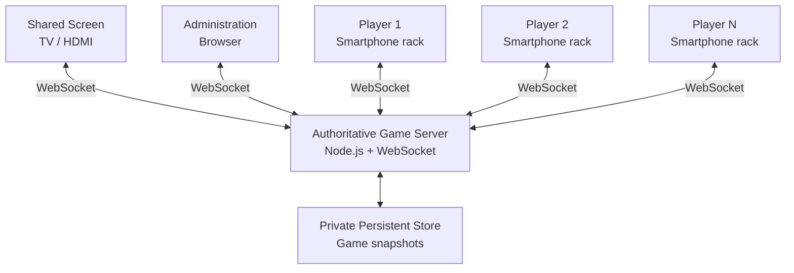
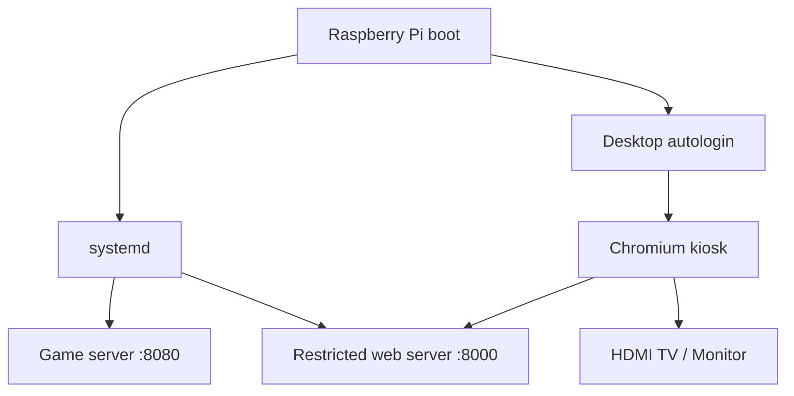

# Electronic Scrabble

Electronic Scrabble is a local multiplayer Scrabble-style application where a shared television or monitor displays the public board while each player's smartphone acts as a private electronic tile rack.

The project is designed to run on a local network and ultimately as a self-contained Raspberry Pi console with no Internet connection required during play.

> **Trademark note:** Scrabble is a registered trademark owned by its respective rights holders. This project is independent and is not affiliated with or endorsed by those rights holders.

## Current Features

- 2 to 4 local players
- 15 × 15 board with standard premium-square layout
- French 102-tile distribution with two blanks
- private seven-tile smartphone racks
- touch-friendly mobile board navigation
- local rack rearrangement and shuffle
- move placement and structural validation
- score calculation, cross words, premium squares, and 50-point seven-tile bonus
- pass and tile exchange actions
- first-player draw
- final scoring and end-game detection
- pluggable word validation
- optional challenge workflow
- persistent game snapshots and automatic reconnection
- elapsed-time or countdown turn clock
- shared themes
- English and French interfaces
- dedicated Raspberry Pi console mode
- administrator-controlled safe reboot and power-off

## Architecture



The game server is authoritative. Browser clients submit intentions; they do not directly modify scores, the bag, racks, or board state.

## Privacy Model

Public clients receive only public state.

The shared screen never receives player rack contents or player recovery tokens. Each smartphone receives only its own private rack state.

Persistent snapshots are private server data and include information that must never be served over HTTP.

## Interfaces

### Administration

```text
/admin/
```

The administration interface creates and resumes games, configures the turn clock, determines the first player, starts play, displays game status, and controls a dedicated Raspberry Pi console when console mode is enabled.

### Player

```text
/player/?game=ABCD
```

The smartphone interface provides the private rack, tile rearrangement, mobile board navigation, move preparation, exchange, pass, challenge, and final result views.

### Shared Screen

Game-specific mode:

```text
/screen/?game=ABCD
```

Dedicated Raspberry Pi console mode:

```text
/screen/?console=1
```

Console mode automatically follows the current local game and survives server restarts without embedding a changing game code in the kiosk URL.

## Internationalization

English is the canonical interface language. Translations are stored as resource bundles:

```text
shared/i18n/
├── en.js
└── fr.js
```

Internal game values are language-neutral. For example, a double-word square remains `DW` internally while the French interface displays `MD` (*Mot Double*).

English and French bundles are tested to expose identical keys.

## Themes

Themes are implemented through CSS custom properties and are independent from game logic and language resources.

```text
shared/css/themes/
├── classic.css
├── midnight.css
└── forest.css
```

A future custom theme only needs to override semantic design tokens.

## Word Validation

The game engine supports a pluggable local dictionary.

No unauthorized ODS word list is included in this repository. If an authorized lexical resource is available, it can be configured privately through environment variables.

Example:

```bash
export ELECTRONIC_SCRABBLE_DICTIONARY_MODE=required
export ELECTRONIC_SCRABBLE_DICTIONARY_PATH=/private/path/authorized-words.txt
export ELECTRONIC_SCRABBLE_DICTIONARY_NAME="Authorized French dictionary"
```

See [`docs/word-validation.md`](docs/word-validation.md).

## Persistence

Games are persisted as private JSON snapshots.

Development default:

```text
~/.local/share/electronic-scrabble/games/
```

Raspberry Pi console default:

```text
/var/lib/electronic-scrabble/games/
```

After a server restart, players, administration, and the shared screen automatically reconnect and resume the persisted game.

See [`docs/persistence-and-turn-clock.md`](docs/persistence-and-turn-clock.md).

## Turn Clock

The administration interface can select:

- elapsed time;
- 60-second countdown;
- 90-second countdown;
- 120-second countdown;
- 180-second countdown;
- disabled.

The clock is displayed on the shared screen. Countdown expiration is currently informational and does not automatically end the player's turn.

## Raspberry Pi Console

The project includes a deployment mode for Raspberry Pi OS with Desktop.



Install from the repository:

```bash
sudo bash deploy/raspberry-pi/install.sh
sudo reboot
```

The installer sets up:

- `electronic-scrabble-server.service`;
- `electronic-scrabble-web.service`;
- private persistent storage;
- Chromium kiosk launch through the Raspberry Pi OS Labwc desktop autostart;
- desktop autologin;
- narrowly scoped administrator reboot and power-off permissions.

Detailed instructions: [`docs/raspberry-pi-console.md`](docs/raspberry-pi-console.md).

## Development Setup

Requirements:

- Node.js
- npm
- a modern browser

Install the WebSocket dependency from the `server` directory:

```bash
cd server
npm install
```

Run the WebSocket server:

```bash
npm start
```

For development, run the restricted static server in another terminal:

```bash
cd server
node static-web-server.js
```

Open:

```text
http://localhost:8000/admin/
http://localhost:8000/player/
http://localhost:8000/screen/?console=1
```

The older `python3 -m http.server` workflow remains convenient for quick local experiments, but the Node static server is preferred because it does not expose the private `server/` directory.

## Testing

From `server/`:

```bash
npm test
```

The test suite covers board layout, tile distribution, scoring, move validation, end-game rules, rack arrangement, internationalization, persistence, turn clock behavior, client contracts, console controls, static-server isolation, and Raspberry Pi deployment contracts.

## Project Structure

```text
electronic-scrabble/
├── admin/
├── deploy/
│   └── raspberry-pi/
├── docs/
├── player/
├── screen/
├── server/
│   ├── dictionary/
│   ├── game/
│   ├── persistence/
│   ├── system/
│   └── test/
├── shared/
│   ├── css/
│   ├── i18n/
│   └── js/
└── README.md
```

## WebSocket Protocol

The protocol is documented in [`docs/protocol.md`](docs/protocol.md).

The server supports, among others:

```text
create-game
resume-admin
watch-game
watch-console
join-game
resume-game
start-game
begin-play
submit-move
accept-pending-move
challenge-pending-move
pass-turn
exchange-tiles
console-system-action
```

## Security Principles

- the server is authoritative;
- private rack contents never enter the public game state;
- recovery tokens are private;
- persistent snapshots are stored outside browser-accessible directories;
- the production static web service exposes only UI directories;
- console power controls accept only fixed reboot/power-off actions;
- the application server runs as a non-root account;
- authorized dictionary files must remain private;
- the local services should not be exposed directly to the public Internet.

## Roadmap

Potential future work includes:

- authorized production French dictionary integration;
- additional languages;
- user-created theme manifests;
- QR-code joining on the shared screen;
- optional timeout policy;
- game history and statistics;
- Raspberry Pi access-point mode for completely standalone Wi-Fi play;
- packaging and update tooling.

## License

A project license has not yet been selected.
