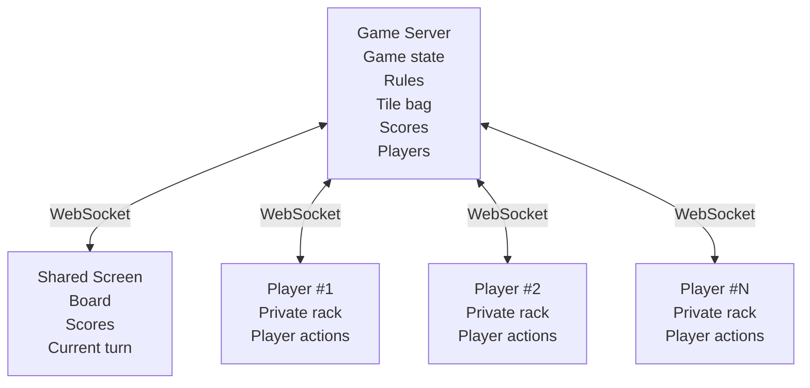
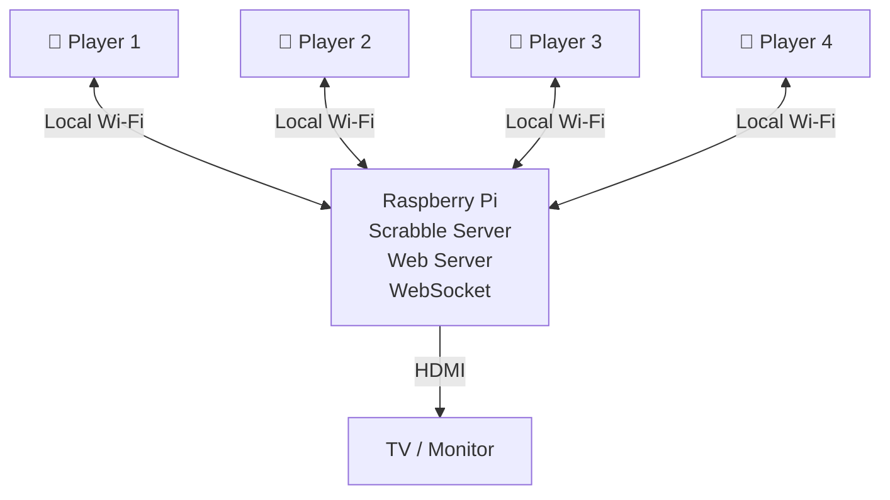

# Electronic Scrabble

An electronic Scrabble game where a shared screen displays the game board while each player's smartphone acts as a private tile rack.

The project is designed to provide a modern, local multiplayer Scrabble experience using a television or monitor, smartphones, and a small local server such as a Raspberry Pi.

## 🎯 Project Goal

Electronic Scrabble aims to reproduce the experience of a physical Scrabble game while replacing the board, tile bag, and player racks with connected devices.

The main screen displays public game information:

* Scrabble board
* Played tiles
* Player names
* Scores
* Current player
* Game history
* Game status

Each player's smartphone provides a private interface containing:

* Tile rack
* Tile selection
* Tile rearrangement
* Move preparation
* Tile exchange
* Pass action
* Move confirmation

Private information such as a player's tiles must never be displayed on the shared screen or sent to other players.

## 🏗️ Architecture

The system is based on a central game server communicating with all devices in real time.



The server is the authoritative source for the game state.

Clients send player intentions to the server. The server validates the requested actions, updates the game state, and sends the appropriate information back to each connected device.

## 📱 Player Connection

Players will join a game using their smartphones.

A typical connection process will be:

1. Start a new game from the administration interface.
2. Display a QR code on the shared screen.
3. Scan the QR code with a smartphone.
4. Enter a player name.
5. Join the game.
6. Receive a private tile rack when the game starts.

No native mobile application should be required.

The player interface is intended to work as a Progressive Web App (PWA).

## 🌐 Local Network

One of the main goals of the project is to allow games to run entirely on a local network.

An Internet connection should not be required during a game.

A future target configuration is:



The Raspberry Pi could eventually create its own Wi-Fi network, making Electronic Scrabble a completely autonomous game console.

## 🗂️ Project Structure

```text
electronic-scrabble/
├── README.md
├── LICENSE
├── .gitignore
├── docs/
├── server/
├── screen/
├── player/
├── admin/
├── shared/
├── tests/
└── docker/
```

### `server/`

Game server and real-time communication.

Eventually responsible for:

* Game creation
* Player management
* Game state
* Tile bag
* Tile distribution
* Move validation
* Score calculation
* Turn management
* WebSocket communication

### `screen/`

Shared display interface.

Designed for a television, monitor, or projector.

### `player/`

Private smartphone interface.

Each player uses this interface as their electronic tile rack.

### `admin/`

Game creation and administration interface.

### `shared/`

Resources and code shared between multiple interfaces.

### `docs/`

Technical documentation, architecture decisions, protocols, and game specifications.

### `tests/`

Automated tests for the game engine and communication layer.

### `docker/`

Development and deployment configuration when required.

## 🚀 Development Roadmap

### Milestone 1 — Real-Time Prototype

Establish communication between the server, shared screen, and smartphones.

* [ ] WebSocket server
* [ ] Shared screen prototype
* [ ] Player interface prototype
* [ ] Smartphone connection
* [ ] Real-time message transmission

### Milestone 2 — Players and Games

* [ ] Game creation
* [ ] QR code generation
* [ ] Player registration
* [ ] Player connection management
* [ ] Game lobby
* [ ] Start game

### Milestone 3 — Tile Management

* [ ] French Scrabble tile bag
* [ ] Random tile drawing
* [ ] Private player racks
* [ ] Rack reordering
* [ ] Tile replacement
* [ ] Tile exchange

### Milestone 4 — Game Board

* [ ] 15 × 15 board
* [ ] Premium squares
* [ ] Tile placement
* [ ] Move preview
* [ ] Move confirmation
* [ ] Board synchronization

### Milestone 5 — Scrabble Engine

* [ ] Move validation
* [ ] Word placement rules
* [ ] Cross-word detection
* [ ] Letter score calculation
* [ ] Word multipliers
* [ ] Letter multipliers
* [ ] Scrabble bonus
* [ ] Turn management
* [ ] Pass action
* [ ] End-game rules

### Milestone 6 — Dictionary

* [ ] French dictionary integration
* [ ] Word verification
* [ ] Invalid word handling
* [ ] Challenge mechanism

### Milestone 7 — Standalone Console

* [ ] Raspberry Pi deployment
* [ ] Automatic server startup
* [ ] HDMI display
* [ ] Local Wi-Fi operation
* [ ] Optional dedicated Wi-Fi access point
* [ ] Full offline operation

## 🔐 Security Principles

The server must remain authoritative.

Clients must never be trusted to:

* Generate tiles
* Choose replacement tiles
* Modify scores
* Modify another player's rack
* Change the game state directly
* Validate their own moves

Each player must only receive information they are authorized to see.

In particular, a player's private rack must never be broadcast to other players.

## 🧪 First Prototype

The first development target is intentionally simple.

A smartphone sends a message through WebSocket:

```json
{
    "type": "player-action",
    "player": "Paul",
    "message": "Hello from my phone"
}
```

The server receives the message and broadcasts the appropriate information to the shared screen.

Once this communication works reliably over a local Wi-Fi network, development can move to game sessions, players, racks, and the Scrabble engine.

## 🛠️ Technology

The final technology stack is not frozen yet.

The initial architecture is expected to use:

* HTML5
* CSS
* JavaScript
* WebSocket
* Progressive Web App technologies
* Raspberry Pi for standalone deployment

Additional server-side technologies and database choices will be selected as the project evolves.

## 🎮 Target Experience

The final objective is simple:

**Turn on the Electronic Scrabble console, display the board on a TV, scan a QR code with each smartphone, and start playing.**

No physical tile bag.

No physical racks.

No manual score calculation.

No Internet connection required.

Just Scrabble around a shared screen.

## 📄 License

The project license has not been selected yet.

> **Note:** Scrabble is a registered trademark owned by its respective rights holders. This project is an independent project and is not affiliated with or endorsed by the trademark owners.
