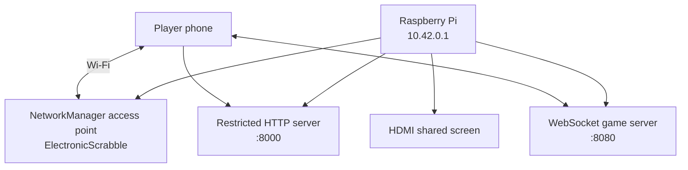

# Autonomous Wi-Fi and QR Joining

Electronic Scrabble can run without an existing router or Internet connection.
A Raspberry Pi can create its own Wi-Fi access point and display two QR codes
on the shared HDMI screen:

1. a Wi-Fi QR code used to join the console network;
2. a game-specific URL QR code used to open the player's rack.

## Network Architecture



NetworkManager `ipv4.method shared` provides the private IPv4 network and DHCP
service for connected players. Electronic Scrabble uses a fixed console address
of `10.42.0.1/24` by default so the player and administration URLs remain stable.

## Configure the Access Point

The Raspberry Pi console installer installs the helper as:

```text
/usr/local/sbin/electronic-scrabble-configure-access-point
```

Configure a profile without activating it immediately:

```bash
sudo /usr/local/sbin/electronic-scrabble-configure-access-point
```

The script creates a NetworkManager connection named:

```text
electronic-scrabble-ap
```

with boot autoconnect enabled. By default it uses:

```text
SSID:    ElectronicScrabble
Address: 10.42.0.1/24
```

If no password is supplied, a random 14-character hexadecimal password is
generated and printed once by the configurator.

To configure your own values:

```bash
sudo ELECTRONIC_SCRABBLE_WIFI_SSID="ScrabbleSalon" \
     ELECTRONIC_SCRABBLE_WIFI_PASSWORD="MyGame1234" \
     ELECTRONIC_SCRABBLE_WIFI_COUNTRY="FR" \
     /usr/local/sbin/electronic-scrabble-configure-access-point
```

Set the regulatory country to the country where the console is physically used.
Do not copy the example country blindly when deploying elsewhere.

### Immediate activation

By default the script does not bring the access point up immediately. This
prevents an installation performed over Wi-Fi SSH from disconnecting itself.

To activate it now:

```bash
sudo /usr/local/sbin/electronic-scrabble-configure-access-point --activate
```

This can terminate an existing Wi-Fi SSH connection on the selected interface.

## Configure During Console Installation

Autonomous Wi-Fi can be configured as part of the console installation:

```bash
sudo ELECTRONIC_SCRABBLE_CONFIGURE_ACCESS_POINT=1 \
     ELECTRONIC_SCRABBLE_WIFI_SSID="ElectronicScrabble" \
     ELECTRONIC_SCRABBLE_WIFI_PASSWORD="MyGame1234" \
     bash deploy/raspberry-pi/install.sh
```

The access-point profile is created for the next boot. It is not activated
mid-installation.

## QR Codes

The static server provides three local endpoints:

```text
/api/console-network
/api/qr/wifi.svg
/api/qr/player.svg?game=ABCD
```

QR generation is completely local. The static server uses the Node.js `qrcode` dependency directly, so the same implementation works on a Raspberry Pi, a Linux VM, or another supported Node.js platform.

No operating-system QR executable or remote QR service is required.

### Wi-Fi QR

The Wi-Fi QR contains a common mobile-device Wi-Fi configuration payload:

```text
WIFI:T:WPA;S:ElectronicScrabble;P:...;H:false;;
```

Reserved characters in the SSID and password are escaped before encoding.

### Player QR

When a game exists, the player QR resolves to a URL such as:

```text
http://10.42.0.1:8000/player/?game=ABCD
```

The game code is therefore already filled in when the player's browser opens.

## Shared-Screen Flow

Before a game exists, the HDMI screen can show:

```text
Connect to Wi-Fi
   [ Wi-Fi QR ]
   Network: ElectronicScrabble
   Password: ********

Administration:
http://10.42.0.1:8000/admin/
```

After an administrator creates a game:

```text
Open your rack
   [ Player QR ]
   http://10.42.0.1:8000/player/?game=ABCD
```

The QR joining panel is hidden once play begins.

## Environment Values

The configurator writes these private console settings to:

```text
/etc/electronic-scrabble/environment
```

Relevant keys are:

```text
ELECTRONIC_SCRABBLE_WIFI_ACCESS_POINT=1
ELECTRONIC_SCRABBLE_WIFI_CONNECTION=electronic-scrabble-ap
ELECTRONIC_SCRABBLE_WIFI_INTERFACE=wlan0
ELECTRONIC_SCRABBLE_WIFI_SSID=ElectronicScrabble
ELECTRONIC_SCRABBLE_WIFI_PASSWORD=...
ELECTRONIC_SCRABBLE_WIFI_ADDRESS=10.42.0.1/24
ELECTRONIC_SCRABBLE_PUBLIC_BASE_URL=http://10.42.0.1:8000
```

The environment file must not be committed to Git because it contains the
actual Wi-Fi password.

## Diagnostics

List NetworkManager connections:

```bash
nmcli connection show
```

Inspect the Electronic Scrabble profile:

```bash
nmcli connection show electronic-scrabble-ap
```

Check the Wi-Fi interface:

```bash
nmcli device status
```

Bring the profile up manually:

```bash
sudo nmcli connection up electronic-scrabble-ap
```

Bring it down:

```bash
sudo nmcli connection down electronic-scrabble-ap
```

Check the public console metadata:

```bash
curl http://127.0.0.1:8000/api/console-network
```

Check QR generation:

```bash
curl --fail http://127.0.0.1:8000/api/qr/wifi.svg >/tmp/wifi.svg
```

## Security

- The Wi-Fi password is deliberately displayed on the shared screen during the
  lobby because players need it to join the private game network.
- Do not expose the console HTTP service directly to the public Internet.
- The QR API cannot encode arbitrary user-provided strings; it only generates
  the configured Wi-Fi payload and validated game-specific player URLs.
- QR generation uses the Node.js `qrcode` dependency and does not invoke a shell command.
- Persistent game snapshots and dictionary files remain outside the public HTTP
  tree.


## Development on a VM or ordinary LAN

QR generation is not Raspberry Pi-specific. The shared-screen player QR code is available whenever the restricted Node.js web server is running. When access-point mode is disabled, the server detects a non-loopback IPv4 address and builds the player URL from that LAN address.

If a VM uses NAT or another address that phones cannot reach, configure the address explicitly:

```bash
export ELECTRONIC_SCRABBLE_PUBLIC_BASE_URL="http://192.168.1.50:8000"
```

Then restart `static-web-server.js`. The Wi-Fi configuration QR is intentionally absent unless autonomous access-point mode is enabled, because the application does not know the credentials of an arbitrary external Wi-Fi network.

QR SVG rendering is performed by the Node.js `qrcode` dependency. Run `npm install` in `server/` after updating the project.
