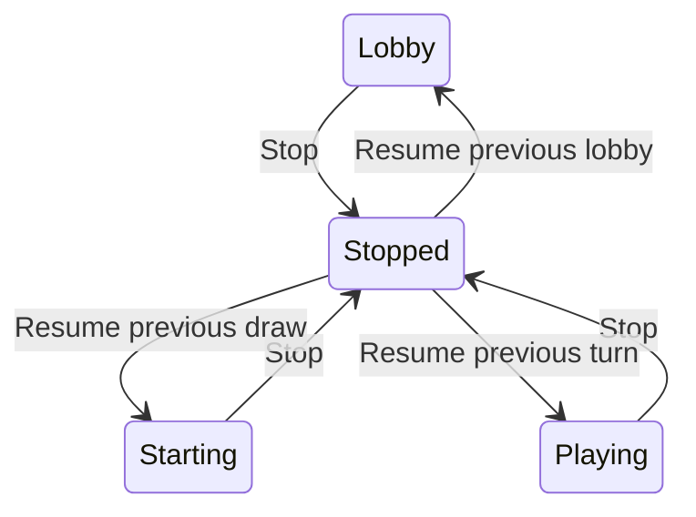

# Game Management

Electronic Scrabble keeps persistent game snapshots and lets an authenticated administrator reopen, resume, or purge games from the administration interface.

## Stopping and Resuming

Stopping a game is a pause, not a normal Scrabble end-game event. The current committed board, bag, racks, scores, turn order, and turn number are persisted. Any still-provisional challenged move is rolled back before the stop is committed.

For a playing game the server remembers the current player. When the administrator resumes the game, the same player regains the turn and the turn clock resumes from its paused elapsed value. Lobby and starting-draw games return to their previous phase.

## History

The administration page lists games for which the current browser still owns a private administrator token. The server never exposes a global unauthenticated list of persisted games.

Each history entry contains only management metadata such as:

- public game code;
- status;
- player names and scores;
- current turn number;
- last update time;
- final winner names when available.

Private racks and authentication tokens are never returned in the history response.

## Purge

Only `finished` and `stopped` games can be purged. Purge permanently removes the JSON snapshot from the configured game-data directory and removes the game from server memory. The administrator must confirm the operation in the browser.

Active `lobby`, `starting`, and `playing` games cannot be purged. Stop them first if they must be removed.

## Browser Ownership

Administrator recovery tokens are stored locally under the existing `electronic-scrabble-admin-session:*` keys. The history request sends only those locally known game-code/token pairs to the server, which validates each pair before returning a summary.
