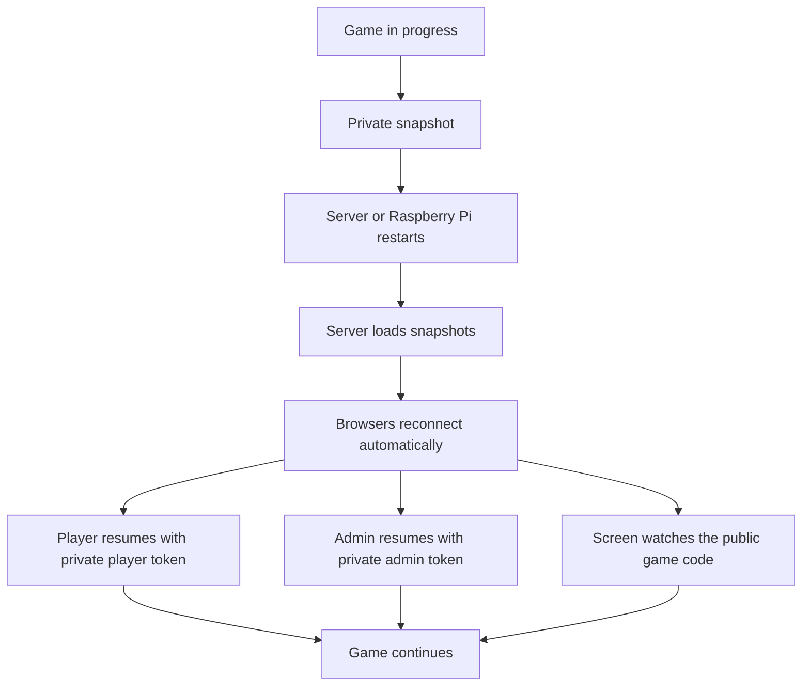

# Persistence and Turn Clock

## Goals

Electronic Scrabble keeps active games recoverable after a Node.js or
Raspberry Pi restart while preserving private player information.

The shared screen also displays a synchronized turn clock.

## Persistent Storage

By default, snapshots are stored outside the web-served project tree:

```text
~/.local/share/electronic-scrabble/games/
```

The location can be overridden:

```bash
export ELECTRONIC_SCRABBLE_DATA_DIR=/var/lib/electronic-scrabble/games
```

Snapshot files contain private data including player recovery tokens and rack
tiles. They must not be copied into a public web directory or committed to Git.

Each game is saved as a separate JSON snapshot using a temporary file followed
by a rename in the same directory.

## Autosave

A snapshot is written whenever a public game-state broadcast follows a state
change. Active games are also saved periodically so the visible turn clock can
be recovered with limited loss after an unexpected power failure.

## Restart Recovery



Server downtime is not intentionally counted against the active player's turn
clock. A running clock is persisted as accumulated elapsed time and restarted
when the game is restored.

## Turn Clock Modes

The administrator can select one of the following before play starts:

- Off
- Elapsed time
- 60-second countdown
- 90-second countdown
- 120-second countdown
- 180-second countdown

The timer is displayed prominently on the shared screen.

A countdown reaching zero changes the display to an expired state but does not
automatically pass the turn. Automatic enforcement can be introduced later as
a separate game option.

## Challenge Window

The turn clock pauses while a submitted move is waiting for acceptance or a
challenge. The next player's clock starts only after the pending move has been
resolved.
