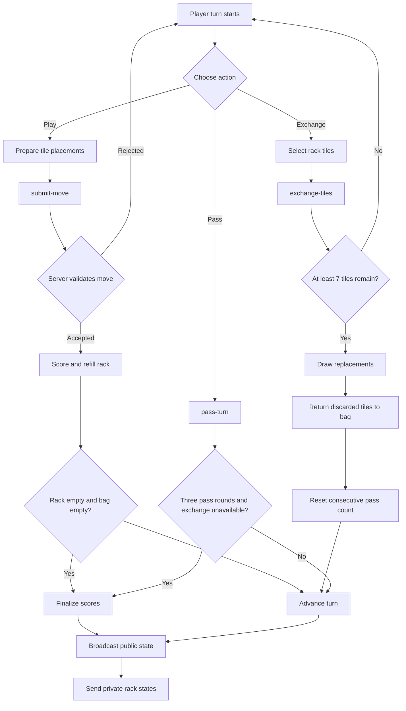
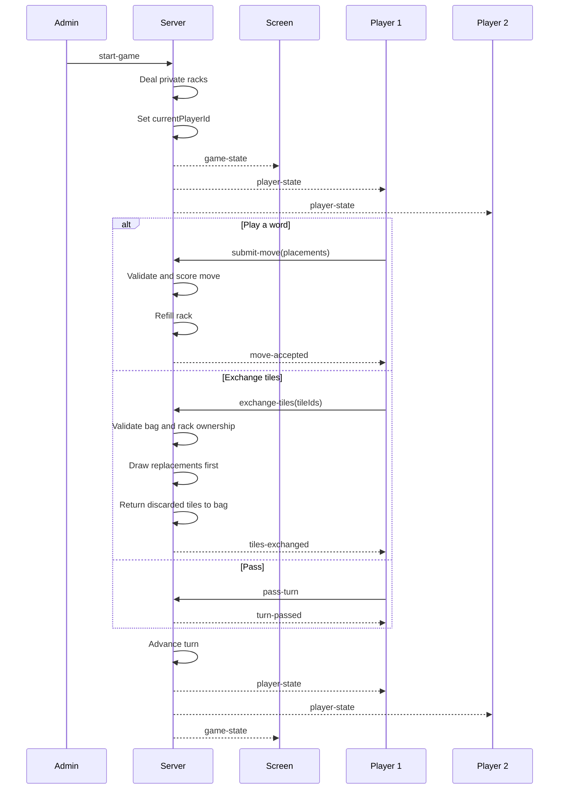
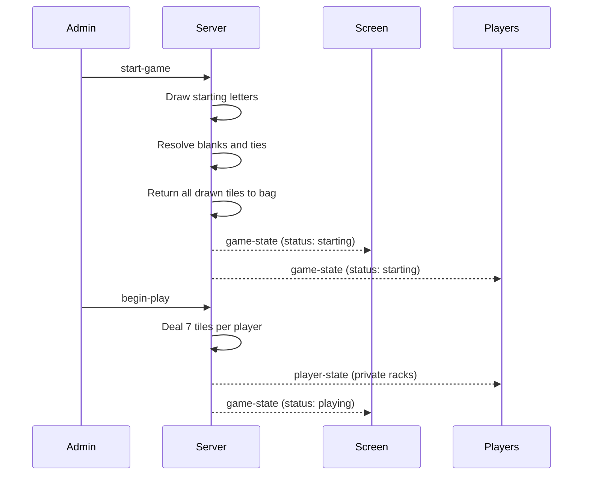
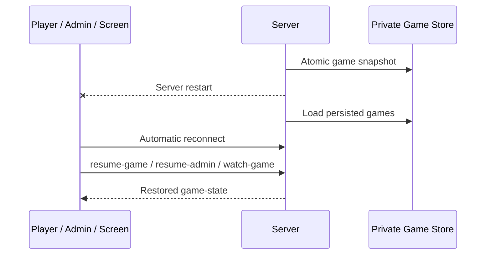

# Electronic Scrabble WebSocket Protocol

## Version 0.7.0

This document describes the WebSocket messages used for game creation,
player sessions, game startup, private racks, validated board moves, passing,
tile exchanges, and final score calculation.

Dictionary validation is **not enabled in milestone 0.7.0**. The server
validates tile ownership, board geometry, connectivity, premium scoring,
blank assignments, turn ownership, and exchange eligibility.

## Complete Turn Flow



## Game Start and Turn Synchronization



## Exchange Rules

An exchange consumes the player's turn.

The server enforces these rules:

- The request must come from the current authenticated player.
- At least one rack tile must be selected.
- Every selected tile identifier must belong to the player's private rack.
- A tile identifier cannot be submitted twice.
- At least seven tiles must remain in the bag before the exchange starts.
- Replacement tiles are drawn before discarded tiles are returned to the bag.
- The discarded tiles are then returned and the bag is reshuffled.
- Public clients receive only the number of exchanged tiles, never their letters or identifiers.


## End-Game Rules

The server supports two classic end-game conditions:

- A player empties their rack after the tile bag is empty.
- Fewer than seven tiles remain in the bag and every player passes three
  consecutive turns, equivalent to three complete rounds of uninterrupted
  passes.

When a player empties their rack, every other player's remaining rack value is
deducted from that player's score and the combined amount is added to the
finishing player's score.

When the game ends because of consecutive passes, each player deducts only the
value of their own remaining rack.

A move or tile exchange resets the uninterrupted pass counter.

The public final result exposes rack **values**, score adjustments, and final
scores, but never the remaining rack letters or private tile identifiers.

Verified rule references:

- FISF, “Formules de jeu – Classique”: https://fisf.net/scrabble/decouverte/formules-de-jeu-classique/
- FISF, International Classic Rules 2020, sections 4.2 and 7: https://classement.fisf.net/documents/FISF_ReglementInternationalClassique2020.pdf

## Client Messages

### Create Game

```json
{
    "type": "create-game"
}
```

### Watch Game

```json
{
    "type": "watch-game",
    "gameCode": "ABCD"
}
```

### Join Game

```json
{
    "type": "join-game",
    "gameCode": "ABCD",
    "playerName": "Alice"
}
```

### Resume Game

```json
{
    "type": "resume-game",
    "gameCode": "ABCD",
    "playerToken": "PRIVATE-UUID"
}
```

### Start Game

```json
{
    "type": "start-game"
}
```

### Submit Move

The client sends only tile identifiers from its private rack and intended
coordinates. The server retrieves the trusted tile values from the rack.

```json
{
    "type": "submit-move",
    "placements": [
        {
            "tileId": "PRIVATE-TILE-UUID",
            "row": 7,
            "column": 7,
            "assignedLetter": null
        }
    ]
}
```

### Pass Turn

```json
{
    "type": "pass-turn"
}
```

### Exchange Tiles

The tile identifiers are private and are sent only from the authenticated
player to the server.

```json
{
    "type": "exchange-tiles",
    "tileIds": [
        "PRIVATE-TILE-UUID-1",
        "PRIVATE-TILE-UUID-2"
    ]
}
```

## Server Messages

### Game Joined

The `playerToken` is private and must never be broadcast to other clients.

```json
{
    "type": "game-joined",
    "gameCode": "ABCD",
    "playerId": "UUID",
    "playerToken": "PRIVATE-UUID",
    "playerName": "Alice"
}
```

### Public Game State

Rack contents, rack tile identifiers, and player tokens are never included.
`lastAction` contains only information that may be displayed publicly.

```json
{
    "type": "game-state",
    "game": {
        "code": "ABCD",
        "status": "playing",
        "bagRemaining": 86,
        "currentPlayerId": "PLAYER-2-UUID",
        "turnNumber": 2,
        "lastAction": {
            "type": "exchange",
            "playerId": "PLAYER-1-UUID",
            "playerName": "Alice",
            "exchangedCount": 2
        },
        "finalResult": null,
        "players": [
            {
                "id": "PLAYER-1-UUID",
                "name": "Alice",
                "score": 10,
                "rackCount": 7,
                "connected": true
            }
        ]
    }
}
```

### Private Player State

This message is sent only to the authenticated player's WebSocket connection.

```json
{
    "type": "player-state",
    "gameCode": "ABCD",
    "player": {
        "id": "PLAYER-1-UUID",
        "name": "Alice",
        "score": 10,
        "isCurrentPlayer": false,
        "rack": [
            {
                "id": "PRIVATE-TILE-UUID",
                "letter": "A",
                "value": 1,
                "isBlank": false
            }
        ]
    }
}
```

### Move Accepted

```json
{
    "type": "move-accepted",
    "gameCode": "ABCD",
    "score": 10,
    "bingoBonus": 0,
    "words": [
        {
            "text": "HI",
            "score": 10
        }
    ]
}
```

### Turn Passed

```json
{
    "type": "turn-passed",
    "gameCode": "ABCD"
}
```

### Tiles Exchanged

The response intentionally contains only the number of exchanged tiles.

```json
{
    "type": "tiles-exchanged",
    "gameCode": "ABCD",
    "exchangedCount": 2
}
```

## Game Finished

The server broadcasts this message when final score adjustments have been
calculated. The same `finalResult` object is also included in subsequent public
`game-state` messages while the game status is `finished`.

```json
{
    "type": "game-finished",
    "gameCode": "ABCD",
    "finalResult": {
        "reason": "rack-emptied",
        "finishingPlayerId": "PLAYER-1-UUID",
        "winnerIds": [
            "PLAYER-1-UUID"
        ],
        "rankings": [
            {
                "playerId": "PLAYER-1-UUID",
                "playerName": "Alice",
                "scoreBeforeAdjustment": 250,
                "rackValue": 0,
                "adjustment": 12,
                "finalScore": 262,
                "position": 1
            }
        ]
    }
}
```

## Privacy Rule

The server is authoritative. Public messages expose only public board and game
information. Private rack contents, rack tile identifiers, exchanged letters,
and reconnection tokens are sent exclusively to the authenticated player's
WebSocket connection.

## Current Limitation

Milestone 0.7.0 does not check whether generated letter sequences are valid
French words. A structurally valid sequence is accepted regardless of its
lexical validity. Dictionary integration is a separate milestone.

## Word Validation

The public `game-state` now includes safe validator information:

```json
{
    "wordValidation": {
        "enabled": true,
        "mode": "required",
        "dictionaryName": "Development fixture",
        "wordCount": 11
    }
}
```

The local dictionary file path and dictionary contents are never exposed.

When a submitted move forms a word that is absent from the configured word
list, the server rejects the complete move:

```json
{
    "type": "error",
    "code": "INVALID_WORD",
    "message": "Invalid word: XYZ.",
    "invalidWords": [
        "XYZ"
    ]
}
```

No board, rack, bag, score, or turn state is changed when word validation
fails.

## Starting Player Selection

Before racks are dealt, the administrator requests the official starting-player draw:

```json
{
    "type": "start-game"
}
```

The server moves the game from `lobby` to `starting`, performs the draw, returns all drawn tiles to the bag, reshuffles it, and publishes `startingPlayerDraw` in the public game state.

When the result has been displayed, the administrator starts actual play:

```json
{
    "type": "begin-play"
}
```

The server deals the private racks, sets the selected player as `currentPlayerId`, sets `turnNumber` to `1`, and moves the game to `playing`.



## Challenge-mode messages

Challenge mode is enabled with:

```text
ELECTRONIC_SCRABBLE_WORD_VALIDATION_POLICY=challenge
```

It requires an enabled dictionary.

### Move pending challenge

```json
{
    "type": "move-pending-challenge",
    "gameCode": "ABCD",
    "score": 18,
    "bingoBonus": 0,
    "words": [
        {
            "text": "ARBRE",
            "score": 18
        }
    ]
}
```

The public `game-state` additionally contains a safe `pendingMove` object while
the challenge window is open.

### Accept a pending move

Only the next player can explicitly close the challenge window without checking
the words.

```json
{
    "type": "accept-pending-move"
}
```

### Challenge a pending move

Any opponent can challenge the pending move.

```json
{
    "type": "challenge-pending-move"
}
```

Successful challenge response:

```json
{
    "type": "challenge-result",
    "gameCode": "ABCD",
    "successful": true,
    "invalidWords": ["XYZ"]
}
```

The moving player also receives:

```json
{
    "type": "move-rejected-after-challenge",
    "gameCode": "ABCD",
    "invalidWords": ["XYZ"]
}
```

If the challenge fails, the staged move is committed and normal play continues.

## Persistent Recovery

Game state is persisted privately by the server. Runtime WebSocket objects are
never serialized.



### Resume Administrator

```json
{
    "type": "resume-admin",
    "gameCode": "ABCD",
    "adminToken": "PRIVATE-TOKEN"
}
```

The administrator token is private and must never be included in a public
`game-state` message.

## Turn Clock

The administrator may configure the shared-screen turn clock before play
begins.

```json
{
    "type": "configure-turn-clock",
    "mode": "countdown",
    "durationSeconds": 120
}
```

Supported modes are:

- `off`
- `elapsed`
- `countdown`

The public game state contains a synchronized clock snapshot:

```json
{
    "turnClock": {
        "mode": "countdown",
        "durationSeconds": 120,
        "elapsedMs": 42500,
        "running": true,
        "expired": false
    }
}
```

Clock expiration is informational in this milestone. It does not automatically
pass a turn or apply a score penalty.

## Dedicated Raspberry Pi Console

The HDMI kiosk uses a game-code-independent screen mode.

### Watch Console

```json
{
    "type": "watch-console"
}
```

When a game is available, the server selects it for the dedicated console:

```json
{
    "type": "console-game-selected",
    "gameCode": "ABCD"
}
```

The normal public `game-state` message follows.

If no game exists:

```json
{
    "type": "console-idle"
}
```

Creating a new game automatically selects it on every connected dedicated console screen.

## Raspberry Pi System Control

System actions require an authenticated administrator session and server-side console control to be explicitly enabled.

### Request Reboot

```json
{
    "type": "console-system-action",
    "action": "reboot"
}
```

### Request Power Off

```json
{
    "type": "console-system-action",
    "action": "poweroff"
}
```

Accepted request:

```json
{
    "type": "console-system-action-accepted",
    "action": "reboot"
}
```

The server persists all games before invoking the fixed host command.

No arbitrary shell command, executable path, or extra command argument is accepted from the browser.


## Stop Game

An authenticated administrator can explicitly terminate an active game without applying normal end-game scoring.

```json
{
    "type": "stop-game"
}
```

The server rolls back any still-provisional challenge move, pauses the turn clock, persists the game with `status: "stopped"`, clears `currentPlayerId`, and broadcasts the new public state. A stopped game does not resume automatically on the dedicated console after a server restart.

The public game state includes:

```json
{
    "status": "stopped",
    "stopReason": "administrator",
    "stoppedAt": 1770000000000,
    "currentPlayerId": null
}
```

## Game Management

### Resume Stopped Game

Authenticated administrator request:

```json
{
    "type": "resume-stopped-game"
}
```

The server restores the phase that was active before the administrative stop.

### List Managed Games

The administration browser submits only its locally stored administrator tokens:

```json
{
    "type": "list-managed-games",
    "sessions": [
        {
            "gameCode": "ABCD",
            "adminToken": "PRIVATE-TOKEN"
        }
    ]
}
```

The response contains management summaries only and never exposes racks or tokens:

```json
{
    "type": "managed-games",
    "games": [
        {
            "code": "ABCD",
            "status": "stopped",
            "playerCount": 2,
            "turnNumber": 8,
            "resumable": true
        }
    ]
}
```

### Purge Game

```json
{
    "type": "purge-game",
    "gameCode": "ABCD",
    "adminToken": "PRIVATE-TOKEN"
}
```

Only stopped or finished games can be purged.

## Per-game word validation

The server advertises administrator-selectable validation options in the
initial administrator connection state as `wordValidationOptions`.

A new game can include:

```json
{
  "type": "create-game",
  "wordValidationProvider": "ffsc",
  "wordValidationPolicy": "challenge"
}
```

While the game is in `lobby` or is administratively paused with
`status: "stopped"`, an authenticated administrator may update those settings:

```json
{
  "type": "configure-word-validation",
  "provider": "local",
  "policy": "automatic"
}
```

The server rejects unavailable providers, unsupported policies, and
configuration changes while the game is actively `starting` or `playing`.
Public game state contains the resolved provider and policy but never local
dictionary paths or provider secrets.

## Console Wi-Fi configuration

An authenticated administrator on a Raspberry Pi installation with Wi-Fi
control enabled can submit:

```json
{
  "type": "configure-console-wifi",
  "ssid": "ElectronicScrabble",
  "password": "Scrabble123",
  "country": "FR",
  "activate": false
}
```

An empty `password` preserves the existing access-point password. A password is
required for the first configuration. `activate: false` updates the persistent
NetworkManager profile for a later activation/reboot; `activate: true` also
brings the profile up immediately and may disconnect the current Wi-Fi client.

The server replies with private administrator-only capability/state messages:

```text
console-wifi-state
console-wifi-configuration-accepted
console-wifi-configuration-applied
console-wifi-configuration-failed
```

`console-wifi-state` never contains the Wi-Fi password. The server validates
the requested values and invokes only the fixed root-owned access-point helper;
it does not accept arbitrary shell commands.
