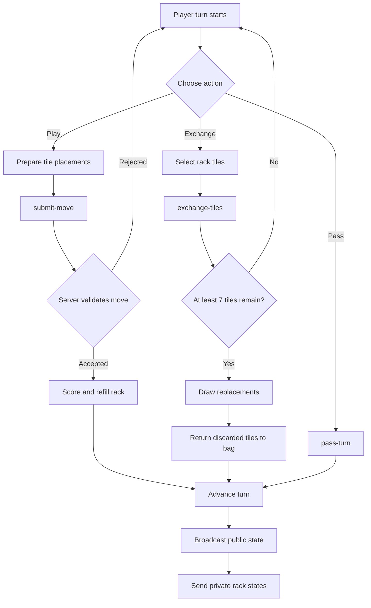
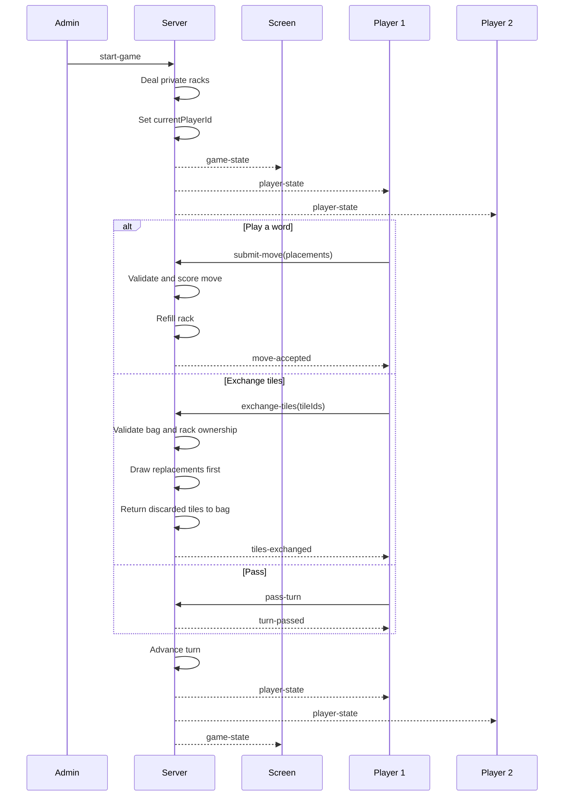

# Electronic Scrabble WebSocket Protocol

## Version 0.6.0

This document describes the WebSocket messages used for game creation,
player sessions, game startup, private racks, validated board moves, passing,
and tile exchanges.

Dictionary validation is **not enabled in milestone 0.6.0**. The server
validates tile ownership, board geometry, connectivity, premium scoring,
blank assignments, turn ownership, and exchange eligibility.

## Complete Turn Flow



## Game Start and Turn Synchronization



## Exchange Rules

An exchange consumes the player's turn.

The server enforces these rules:

- The request must come from the current authenticated player.
- At least one rack tile must be selected.
- Every selected tile identifier must belong to the player's private rack.
- A tile identifier cannot be submitted twice.
- At least seven tiles must remain in the bag before the exchange starts.
- Replacement tiles are drawn before discarded tiles are returned to the bag.
- The discarded tiles are then returned and the bag is reshuffled.
- Public clients receive only the number of exchanged tiles, never their letters or identifiers.

## Client Messages

### Create Game

```json
{
    "type": "create-game"
}
```

### Watch Game

```json
{
    "type": "watch-game",
    "gameCode": "ABCD"
}
```

### Join Game

```json
{
    "type": "join-game",
    "gameCode": "ABCD",
    "playerName": "Alice"
}
```

### Resume Game

```json
{
    "type": "resume-game",
    "gameCode": "ABCD",
    "playerToken": "PRIVATE-UUID"
}
```

### Start Game

```json
{
    "type": "start-game"
}
```

### Submit Move

The client sends only tile identifiers from its private rack and intended
coordinates. The server retrieves the trusted tile values from the rack.

```json
{
    "type": "submit-move",
    "placements": [
        {
            "tileId": "PRIVATE-TILE-UUID",
            "row": 7,
            "column": 7,
            "assignedLetter": null
        }
    ]
}
```

### Pass Turn

```json
{
    "type": "pass-turn"
}
```

### Exchange Tiles

The tile identifiers are private and are sent only from the authenticated
player to the server.

```json
{
    "type": "exchange-tiles",
    "tileIds": [
        "PRIVATE-TILE-UUID-1",
        "PRIVATE-TILE-UUID-2"
    ]
}
```

## Server Messages

### Game Joined

The `playerToken` is private and must never be broadcast to other clients.

```json
{
    "type": "game-joined",
    "gameCode": "ABCD",
    "playerId": "UUID",
    "playerToken": "PRIVATE-UUID",
    "playerName": "Alice"
}
```

### Public Game State

Rack contents, rack tile identifiers, and player tokens are never included.
`lastAction` contains only information that may be displayed publicly.

```json
{
    "type": "game-state",
    "game": {
        "code": "ABCD",
        "status": "playing",
        "bagRemaining": 86,
        "currentPlayerId": "PLAYER-2-UUID",
        "turnNumber": 2,
        "lastAction": {
            "type": "exchange",
            "playerId": "PLAYER-1-UUID",
            "playerName": "Alice",
            "exchangedCount": 2
        },
        "players": [
            {
                "id": "PLAYER-1-UUID",
                "name": "Alice",
                "score": 10,
                "rackCount": 7,
                "connected": true
            }
        ]
    }
}
```

### Private Player State

This message is sent only to the authenticated player's WebSocket connection.

```json
{
    "type": "player-state",
    "gameCode": "ABCD",
    "player": {
        "id": "PLAYER-1-UUID",
        "name": "Alice",
        "score": 10,
        "isCurrentPlayer": false,
        "rack": [
            {
                "id": "PRIVATE-TILE-UUID",
                "letter": "A",
                "value": 1,
                "isBlank": false
            }
        ]
    }
}
```

### Move Accepted

```json
{
    "type": "move-accepted",
    "gameCode": "ABCD",
    "score": 10,
    "bingoBonus": 0,
    "words": [
        {
            "text": "HI",
            "score": 10
        }
    ]
}
```

### Turn Passed

```json
{
    "type": "turn-passed",
    "gameCode": "ABCD"
}
```

### Tiles Exchanged

The response intentionally contains only the number of exchanged tiles.

```json
{
    "type": "tiles-exchanged",
    "gameCode": "ABCD",
    "exchangedCount": 2
}
```

## Privacy Rule

The server is authoritative. Public messages expose only public board and game
information. Private rack contents, rack tile identifiers, exchanged letters,
and reconnection tokens are sent exclusively to the authenticated player's
WebSocket connection.

## Current Limitation

Milestone 0.6.0 does not check whether generated letter sequences are valid
French words. A structurally valid sequence is accepted regardless of its
lexical validity. Dictionary integration is a separate milestone.
