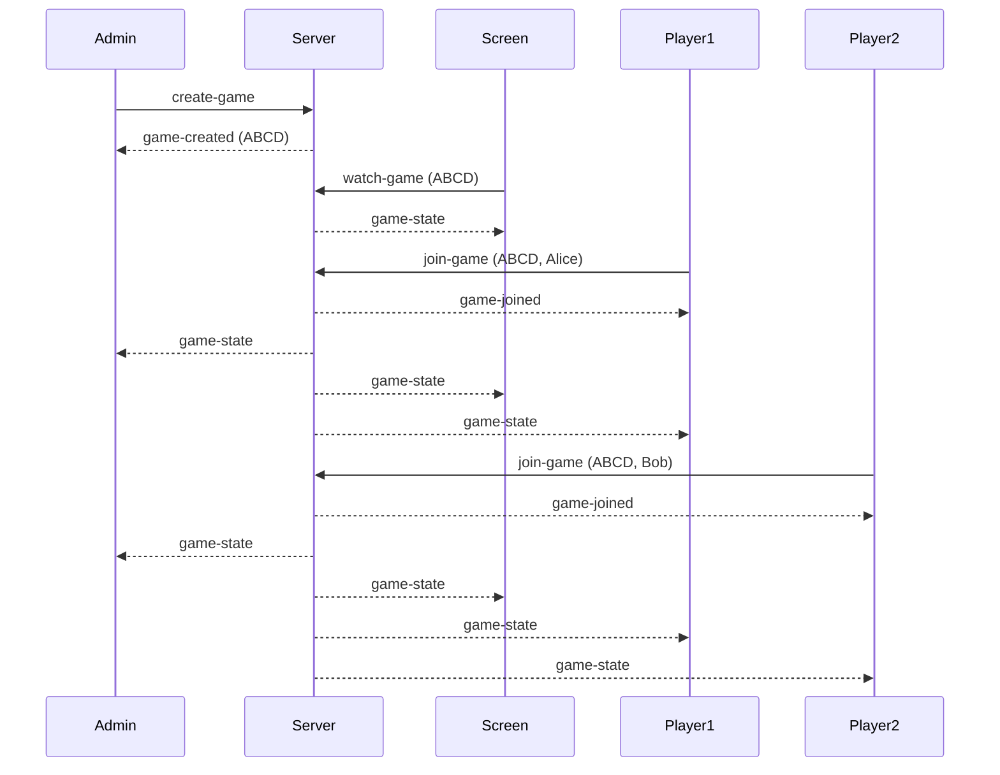

# Electronic Scrabble WebSocket Protocol

## Game Lobby



## Client Messages

### Create Game

```json
{
    "type": "create-game"
}
```

### Watch Game

```json
{
    "type": "watch-game",
    "gameCode": "ABCD"
}
```

### Join Game

```json
{
    "type": "join-game",
    "gameCode": "ABCD",
    "playerName": "Alice"
}
```

## Server Messages

### Game Created

```json
{
    "type": "game-created",
    "gameCode": "ABCD"
}
```

### Game Joined

```json
{
    "type": "game-joined",
    "gameCode": "ABCD",
    "playerId": "UUID",
    "playerName": "Alice"
}
```

### Public Game State

```json
{
    "type": "game-state",
    "game": {
        "code": "ABCD",
        "status": "lobby",
        "players": [
            {
                "id": "UUID",
                "name": "Alice"
            }
        ]
    }
}
```