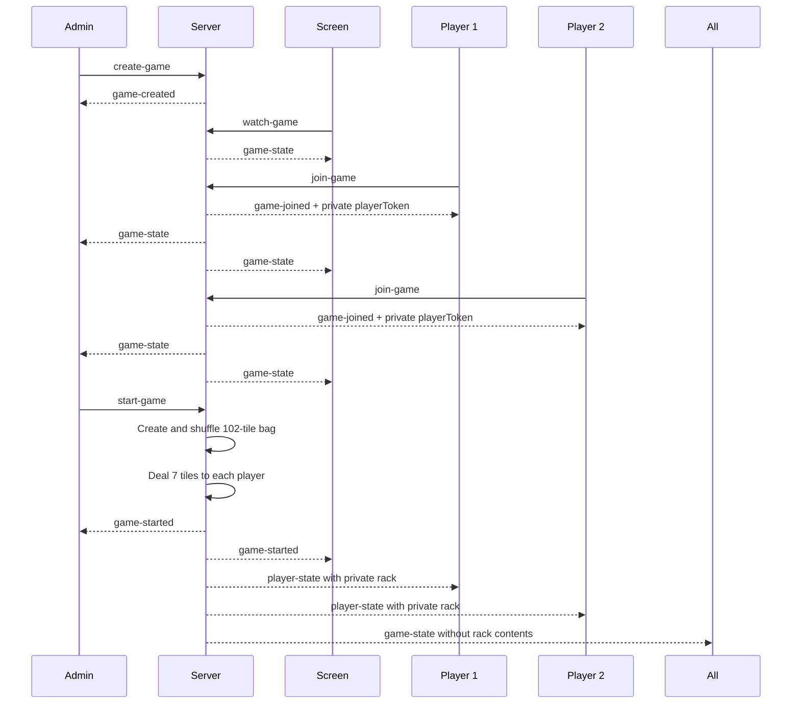
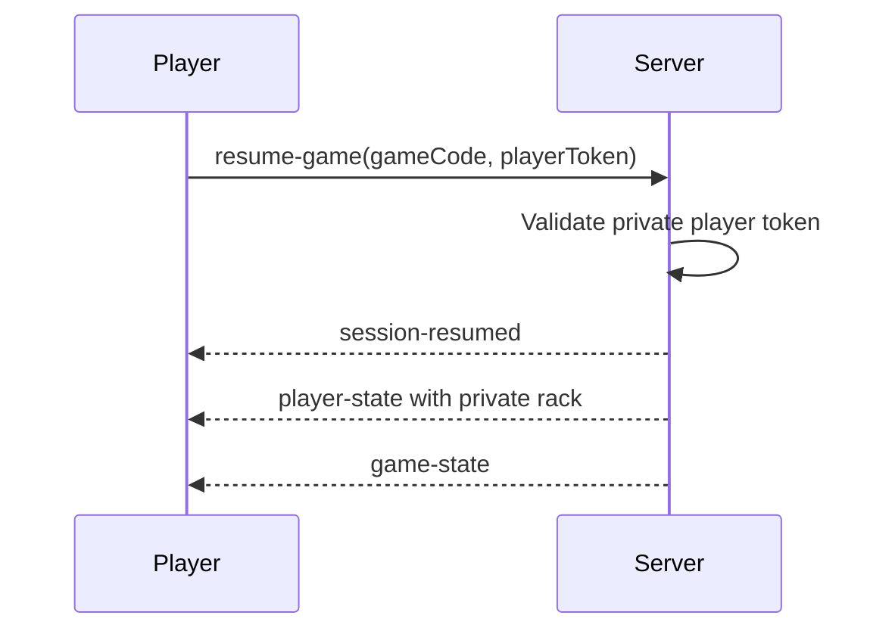

# Electronic Scrabble WebSocket Protocol

## Version 0.3.0

This document describes the WebSocket messages used during game creation,
lobby synchronization, player reconnection, and game startup.

## Lobby and Game Start



## Player Reconnection



## Client Messages

### Create Game

```json
{
    "type": "create-game"
}
```

### Watch Game

```json
{
    "type": "watch-game",
    "gameCode": "ABCD"
}
```

### Join Game

```json
{
    "type": "join-game",
    "gameCode": "ABCD",
    "playerName": "Alice"
}
```

### Resume Game

```json
{
    "type": "resume-game",
    "gameCode": "ABCD",
    "playerToken": "PRIVATE-UUID"
}
```

### Start Game

```json
{
    "type": "start-game"
}
```

## Server Messages

### Game Created

```json
{
    "type": "game-created",
    "gameCode": "ABCD"
}
```

### Game Joined

The `playerToken` is private and must never be broadcast to other clients.

```json
{
    "type": "game-joined",
    "gameCode": "ABCD",
    "playerId": "UUID",
    "playerToken": "PRIVATE-UUID",
    "playerName": "Alice"
}
```

### Session Resumed

```json
{
    "type": "session-resumed",
    "gameCode": "ABCD",
    "playerId": "UUID",
    "playerName": "Alice"
}
```

### Public Game State

Rack contents and player tokens are never included in this message.

```json
{
    "type": "game-state",
    "game": {
        "code": "ABCD",
        "status": "playing",
        "bagRemaining": 88,
        "players": [
            {
                "id": "UUID",
                "name": "Alice",
                "score": 0,
                "rackCount": 7,
                "connected": true
            },
            {
                "id": "UUID",
                "name": "Bob",
                "score": 0,
                "rackCount": 7,
                "connected": true
            }
        ]
    }
}
```

### Private Player State

This message is sent only to the authenticated player's WebSocket connection.

```json
{
    "type": "player-state",
    "gameCode": "ABCD",
    "player": {
        "id": "UUID",
        "name": "Alice",
        "score": 0,
        "rack": [
            {
                "id": "UUID",
                "letter": "A",
                "value": 1,
                "isBlank": false
            }
        ]
    }
}
```

## Privacy Rule

The server is authoritative. Public messages may expose only public game data.
Private rack contents and reconnection tokens must be sent exclusively to the
WebSocket connection authenticated for the corresponding player.
