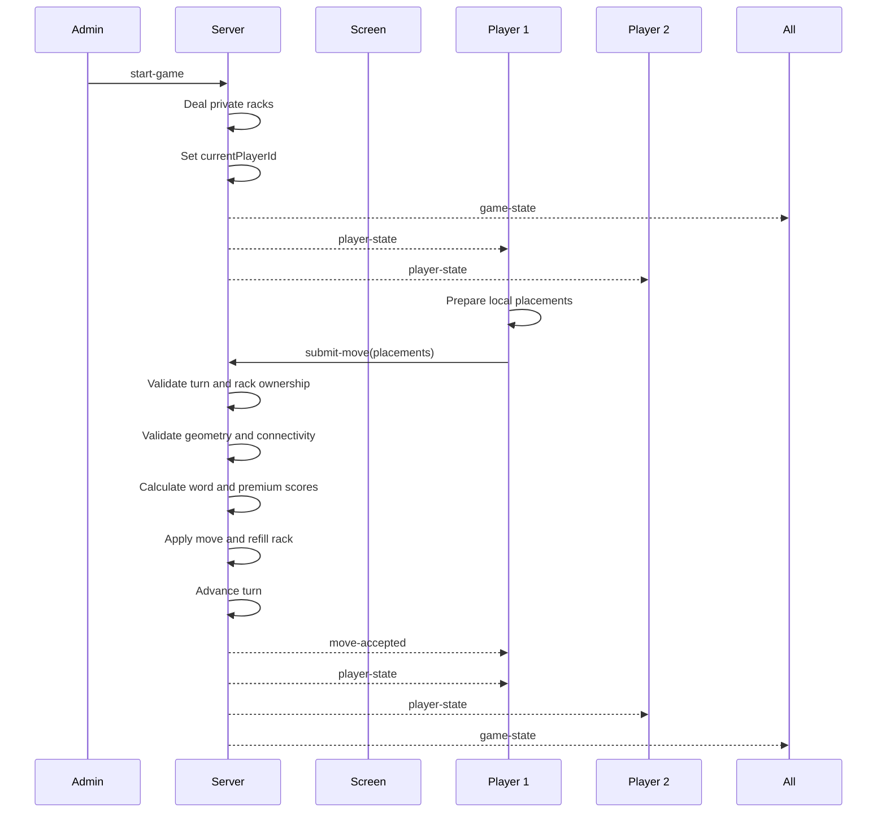
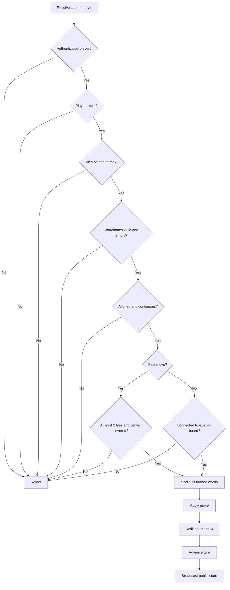

# Electronic Scrabble WebSocket Protocol

## Version 0.5.0

This document describes the WebSocket messages used for game creation,
player sessions, game startup, private racks, turn synchronization, and
validated board moves.

Dictionary validation is **not enabled in milestone 0.5.0**. The server
validates tile ownership, board geometry, connectivity, premium scoring,
blank assignments, and turn ownership only.

## Game Start and Move Flow



## Move Validation



## Client Messages

### Create Game

```json
{
    "type": "create-game"
}
```

### Watch Game

```json
{
    "type": "watch-game",
    "gameCode": "ABCD"
}
```

### Join Game

```json
{
    "type": "join-game",
    "gameCode": "ABCD",
    "playerName": "Alice"
}
```

### Resume Game

```json
{
    "type": "resume-game",
    "gameCode": "ABCD",
    "playerToken": "PRIVATE-UUID"
}
```

### Start Game

```json
{
    "type": "start-game"
}
```

### Submit Move

The client sends only tile identifiers from its private rack and intended
coordinates. The server retrieves the trusted tile values from the rack.

```json
{
    "type": "submit-move",
    "placements": [
        {
            "tileId": "PRIVATE-TILE-UUID",
            "row": 7,
            "column": 7,
            "assignedLetter": null
        },
        {
            "tileId": "PRIVATE-TILE-UUID",
            "row": 7,
            "column": 8,
            "assignedLetter": null
        }
    ]
}
```

For a blank tile, `assignedLetter` must contain exactly one letter from A to Z.

## Server Messages

### Game Joined

The `playerToken` is private and must never be broadcast to other clients.

```json
{
    "type": "game-joined",
    "gameCode": "ABCD",
    "playerId": "UUID",
    "playerToken": "PRIVATE-UUID",
    "playerName": "Alice"
}
```

### Public Game State

Rack contents, rack tile identifiers, and player tokens are never included.

```json
{
    "type": "game-state",
    "game": {
        "code": "ABCD",
        "status": "playing",
        "bagRemaining": 86,
        "currentPlayerId": "PLAYER-2-UUID",
        "turnNumber": 2,
        "lastMove": {
            "playerId": "PLAYER-1-UUID",
            "playerName": "Alice",
            "score": 10,
            "bingoBonus": 0,
            "words": [
                {
                    "text": "HI",
                    "score": 10
                }
            ],
            "placements": [
                { "row": 7, "column": 7 },
                { "row": 7, "column": 8 }
            ]
        },
        "players": [
            {
                "id": "PLAYER-1-UUID",
                "name": "Alice",
                "score": 10,
                "rackCount": 7,
                "connected": true
            }
        ]
    }
}
```

### Private Player State

This message is sent only to the authenticated player's WebSocket connection.

```json
{
    "type": "player-state",
    "gameCode": "ABCD",
    "player": {
        "id": "PLAYER-1-UUID",
        "name": "Alice",
        "score": 10,
        "isCurrentPlayer": false,
        "rack": [
            {
                "id": "PRIVATE-TILE-UUID",
                "letter": "A",
                "value": 1,
                "isBlank": false
            }
        ]
    }
}
```

### Move Accepted

```json
{
    "type": "move-accepted",
    "gameCode": "ABCD",
    "score": 10,
    "bingoBonus": 0,
    "words": [
        {
            "text": "HI",
            "score": 10
        }
    ]
}
```

## Privacy Rule

The server is authoritative. Public messages expose only public board and game
information. Private rack contents, rack tile identifiers, and reconnection
tokens are sent exclusively to the authenticated player's WebSocket.

## Current Limitation

Milestone 0.5.0 does not check whether generated letter sequences are valid
French words. A structurally valid sequence is accepted regardless of its
lexical validity. Dictionary integration is a separate milestone.
