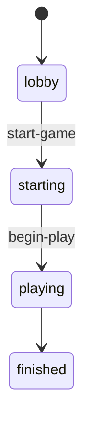

# Starting Player Selection

Electronic Scrabble determines the first player before private racks are dealt.

## Rule

The implementation follows the francophone classic Scrabble starting rule:

1. Every player draws one tile from the bag.
2. A blank tile does not count and must be redrawn.
3. The player whose letter is alphabetically closest to `A` wins.
4. If several players share the best letter, only those tied players draw again.
5. All tiles used during the starting-player draw remain outside the bag until the winner is known.
6. Every drawn tile is then returned to the bag and the bag is reshuffled.
7. Private racks are dealt only after this process is complete.

The remaining turn order preserves lobby join order and is rotated so the selected starting player becomes first.

## Game States



The `starting` state exists specifically so the shared screen can display the draw result before racks are distributed.

## Public State

Example:

```json
{
    "status": "starting",
    "startingPlayerDraw": {
        "rounds": [
            {
                "round": 1,
                "bestLetter": "C",
                "tiedPlayerIds": [],
                "draws": [
                    {
                        "playerId": "PLAYER-1",
                        "playerName": "Alice",
                        "letter": "M",
                        "blankRedraws": 0
                    },
                    {
                        "playerId": "PLAYER-2",
                        "playerName": "Bob",
                        "letter": "C",
                        "blankRedraws": 0
                    }
                ]
            }
        ],
        "startingPlayerId": "PLAYER-2",
        "startingPlayerName": "Bob",
        "returnedTileCount": 2
    }
}
```

Tile IDs are never included in this public result.

## Protocol

### Determine Starting Player

Administrator to server:

```json
{
    "type": "start-game"
}
```

The game enters `starting` and the server broadcasts the public draw result.

### Deal Racks and Begin Play

Administrator to server:

```json
{
    "type": "begin-play"
}
```

The server then deals seven private tiles to every player and enters `playing`.
