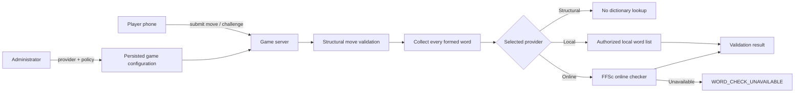

# Word Validation

Electronic Scrabble validates words on the authoritative Node.js server. The
move engine does not contain a hard-coded dictionary and can use different
validation providers on a per-game basis.

## Per-game administrator configuration

The administrator chooses the word-validation provider and policy while the
game is in the lobby. The selected configuration is persisted with the game
snapshot and restored after a server restart.

The provider and policy are locked while the game is actively in the
`starting` or `playing` phase. If the administrator notices a configuration
mistake after launch, the game can be paused with **Stop Game**, the provider
or policy can be corrected while `status: "stopped"`, and the game can then be
resumed. The board, scores, turn, rack state, and paused clock remain intact.

The provider selector can expose:

- `structural`: placement and scoring rules only;
- `local`: an authorized private word list, when configured;
- `ffsc`: the optional FFSc online checker, when enabled.

The `local` and `ffsc` providers support two policies:

- `automatic`: every formed word is checked before the move is committed;
- `challenge`: the move is staged and words are checked only if challenged.

The structural provider always uses the internal `structural` policy.

## Provider availability

The server advertises only providers that are actually available. Structural
validation is always present. The local provider appears only when
`ELECTRONIC_SCRABBLE_DICTIONARY_PATH` points to an authorized word list. The
FFSc provider is enabled by default but can be removed from administrator
choices with:

```bash
export ELECTRONIC_SCRABBLE_FFSC_PROVIDER_ENABLED=false
```

Environment variables define available providers and the default selection;
the administrator then chooses the configuration for each new game.

## Architecture



The client never decides whether a word is valid.

## Local Dictionary Provider

The local provider expects a UTF-8 text file with one playable word per line.

```text
ARBRE
CHAT
CHATS
MAISON
```

Requirements:

- uppercase or lowercase A-Z input is accepted;
- entries must normalize to 2 through 15 A-Z letters;
- blank lines are ignored;
- lines beginning with `#` are comments;
- accents, spaces, hyphens, punctuation, and definitions are rejected.

Example configuration:

```bash
export ELECTRONIC_SCRABBLE_DICTIONARY_PATH=./dictionary/authorized-words.txt
export ELECTRONIC_SCRABBLE_DICTIONARY_NAME="Licensed French dictionary"
npm start
```

The local provider then becomes selectable in the administration interface.

## FFSc Online Provider

The optional online provider queries the checker currently used by the
Fédération Française de Scrabble website.

The server sends an HTTP POST to:

```text
https://www.ffscrabble.fr/wp-admin/admin-ajax.php
```

with the form fields:

```text
action=verifier_mot
mot=CHAT
```

and browser-like request metadata including:

```text
Referer: https://www.ffscrabble.fr/verificateur-de-mots/
Origin: https://www.ffscrabble.fr
X-Requested-With: XMLHttpRequest
```

`Referer` is the historical HTTP header spelling; it is intentionally not
spelled `Referrer`.

The current FFSc result markup uses:

```html
<span class="answer right-answer">...</span>
```

for a valid word and:

```html
<span class="answer wrong-answer">...</span>
```

for an invalid word. Electronic Scrabble parses only these class tokens and
does not depend on the French sentence text.

### Failure policy

The remote checker requires Internet access. Timeout, DNS/network failure,
non-success HTTP responses, empty responses, and unexpected markup are reported
as `WORD_CHECK_UNAVAILABLE`.

Provider unavailability is **never** interpreted as an invalid word. In
challenge mode the pending move remains unresolved so the players can retry.

### Cache and request discipline

The provider:

- caches individual results in memory;
- deduplicates simultaneous checks for the same word;
- validates multiple formed words sequentially;
- uses a bounded cache;
- does not crawl, enumerate, or attempt to reconstruct the ODS database.

The FFSc endpoint is part of the federation website implementation and is not
documented as a public third-party API contract. The adapter is intentionally
isolated in `server/game/ffsc-word-validator.js` so it can be disabled or
updated if the website changes.

Optional settings:

```bash
export ELECTRONIC_SCRABBLE_FFSC_PROVIDER_ENABLED=true
export ELECTRONIC_SCRABBLE_FFSC_TIMEOUT_MS=5000
export ELECTRONIC_SCRABBLE_FFSC_ENDPOINT="https://www.ffscrabble.fr/wp-admin/admin-ajax.php"
export ELECTRONIC_SCRABBLE_FFSC_REFERER="https://www.ffscrabble.fr/verificateur-de-mots/"
```

## Challenge penalty

When the FFSc checker confirms that all challenged words are valid, the current
five-point unsuccessful-challenge penalty is applied to the challenger. A
successful challenge rolls back the staged move and the moving player loses the
turn.

## Privacy

No local dictionary file is sent to browsers. Public game state contains only
safe provider metadata such as provider type, display name, online status,
local word count when available, and validation policy. Remote FFSc response
HTML is never forwarded to clients.
