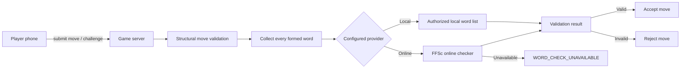

# Word Validation

Electronic Scrabble validates words on the authoritative Node.js server. The
move engine does not contain a hard-coded dictionary and can use different
validation providers.

## Official French Reference

The French-language project targets ODS 9. Electronic Scrabble does **not**
distribute an ODS word list.

The project supports two practical validation strategies:

1. a private authorized local word list;
2. the FFSc online word checker when Internet access is available.

## Architecture



The client never decides whether a word is valid.

## Local Dictionary Provider

The local provider expects a UTF-8 text file with one playable word per line.

```text
ARBRE
CHAT
CHATS
MAISON
```

Requirements:

- uppercase or lowercase A-Z input is accepted;
- entries must normalize to 2 through 15 A-Z letters;
- blank lines are ignored;
- lines beginning with `#` are comments;
- accents, spaces, hyphens, punctuation, and definitions are rejected.

### Optional Local Validation

```bash
export ELECTRONIC_SCRABBLE_DICTIONARY_MODE=optional
export ELECTRONIC_SCRABBLE_DICTIONARY_PATH=./dictionary/authorized-words.txt
export ELECTRONIC_SCRABBLE_DICTIONARY_NAME="Licensed French dictionary"
npm start
```

### Required Local Validation

```bash
export ELECTRONIC_SCRABBLE_DICTIONARY_MODE=required
export ELECTRONIC_SCRABBLE_DICTIONARY_PATH=./dictionary/authorized-words.txt
export ELECTRONIC_SCRABBLE_DICTIONARY_NAME="Licensed French dictionary"
npm start
```

## FFSc Online Provider

The online provider queries the checker currently used by the Fédération
Française de Scrabble website.

Configuration:

```bash
export ELECTRONIC_SCRABBLE_DICTIONARY_MODE=ffsc
export ELECTRONIC_SCRABBLE_DICTIONARY_NAME="FFSc ODS 9 online"
export ELECTRONIC_SCRABBLE_WORD_VALIDATION_POLICY=challenge
npm start
```

The server sends an HTTP POST to:

```text
https://www.ffscrabble.fr/wp-admin/admin-ajax.php
```

with the form fields:

```text
action=verifier_mot
mot=CHAT
```

and browser-like request metadata including:

```text
Referer: https://www.ffscrabble.fr/verificateur-de-mots/
Origin: https://www.ffscrabble.fr
X-Requested-With: XMLHttpRequest
```

`Referer` is the historical HTTP header spelling; it is intentionally not
spelled `Referrer`.

The current FFSc result markup uses:

```html
<span class="answer right-answer">...</span>
```

for a valid word and:

```html
<span class="answer wrong-answer">...</span>
```

for an invalid word. Electronic Scrabble parses only these class tokens and
does not depend on the French sentence text.

### Failure Policy

The remote checker requires Internet access. The following conditions are
reported as `WORD_CHECK_UNAVAILABLE`:

- timeout;
- DNS or network failure;
- non-success HTTP response;
- empty response;
- response markup containing neither or both expected answer classes.

Provider unavailability is **never** interpreted as an invalid word. In
challenge mode the pending move remains unresolved so the players can retry or
use another configured validation policy.

### Cache and Request Discipline

The provider:

- caches individual results in memory;
- deduplicates simultaneous checks for the same word;
- validates multiple formed words sequentially;
- uses a bounded cache;
- does not crawl, enumerate, or attempt to reconstruct the ODS database.

This endpoint is part of the FFSc website implementation and is not documented
as a public third-party API contract. The adapter is intentionally isolated in
`server/game/ffsc-word-validator.js` so it can be disabled or updated if the
website changes.

### Optional FFSc Settings

```bash
export ELECTRONIC_SCRABBLE_FFSC_TIMEOUT_MS=5000
export ELECTRONIC_SCRABBLE_FFSC_ENDPOINT="https://www.ffscrabble.fr/wp-admin/admin-ajax.php"
export ELECTRONIC_SCRABBLE_FFSC_REFERER="https://www.ffscrabble.fr/verificateur-de-mots/"
```

The endpoint and referer overrides are intended mainly for testing or future
maintenance.

## Disabled Validation

```bash
export ELECTRONIC_SCRABBLE_DICTIONARY_MODE=off
npm start
```

## Validation Policy

`automatic` checks words before committing a move:

```bash
export ELECTRONIC_SCRABBLE_WORD_VALIDATION_POLICY=automatic
```

`challenge` stages the move and checks words only when an opponent challenges:

```bash
export ELECTRONIC_SCRABBLE_WORD_VALIDATION_POLICY=challenge
```

Both policies support the FFSc provider. During a remote lookup, mutating turn
actions are temporarily locked to avoid race conditions. In challenge mode, a
failed challenge against valid words applies the current 5-point challenger
penalty indicated by the FFSc checker response.

## Privacy

No local dictionary file is sent to browsers. Public game state contains only:

- whether validation is enabled;
- provider type;
- display name;
- whether the provider is online;
- local word count when available;
- validation policy.

No remote response HTML is forwarded to clients.
