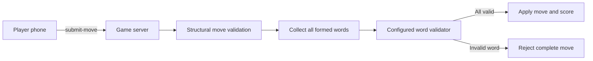

# Word Validation

Electronic Scrabble supports server-side validation of every word created by a
move.

## Official French Reference

The official reference for French-language Scrabble is *L'Officiel du
Scrabble* (ODS). ODS 9 has been in force since 1 January 2024.

Electronic Scrabble does **not** distribute an ODS word list. The FISF states
that digital products using an ODS-compliant word database require appropriate
licensing through Larousse.

Official information:

- https://fisf.net/lofficiel-du-scrabble/
- https://fisf.net/lofficiel-du-scrabble/questions-reponses/

## Architecture

Word validation is deliberately independent from the move engine:



The client never decides whether a word is valid.

## Dictionary Format

The validator expects a local UTF-8 text file with one playable word per line.

```text
ARBRE
CHAT
CHATS
MAISON
```

Requirements:

- uppercase or lowercase A-Z input is accepted;
- entries must normalize to 2 through 15 A-Z letters;
- blank lines are ignored;
- lines beginning with `#` are comments;
- accents, spaces, hyphens, punctuation, and definitions are rejected;
- the application does not transform an ordinary French dictionary into an
  ODS-compatible list.

## Configuration

Three environment variables are supported.

### Optional Validation

This is the default mode. The server starts without a dictionary and performs
structural validation only.

```bash
export ELECTRONIC_SCRABBLE_DICTIONARY_MODE=optional
export ELECTRONIC_SCRABBLE_DICTIONARY_PATH=./dictionary/authorized-words.txt
export ELECTRONIC_SCRABBLE_DICTIONARY_NAME="Licensed French dictionary"
npm start
```

### Required Validation

The server refuses to start when no dictionary path is configured.

```bash
export ELECTRONIC_SCRABBLE_DICTIONARY_MODE=required
export ELECTRONIC_SCRABBLE_DICTIONARY_PATH=./dictionary/authorized-words.txt
export ELECTRONIC_SCRABBLE_DICTIONARY_NAME="Licensed French dictionary"
npm start
```

### Disabled Validation

```bash
export ELECTRONIC_SCRABBLE_DICTIONARY_MODE=off
npm start
```

## Privacy and Distribution

The dictionary file itself is never sent to browser clients. Public game state
contains only:

- whether validation is enabled;
- the configured display name;
- the number of loaded words;
- the configured validation mode.

The local `server/dictionary/` directory ignores dictionary files in Git by
default. This is intended to reduce the risk of accidentally publishing
licensed lexical data.

## Move Rejection

All words formed by a move, including cross words, are validated before the
board, rack, bag, score, or turn order is modified.

When one or more words are absent, the player receives an `INVALID_WORD` error
and the entire move is rejected.
